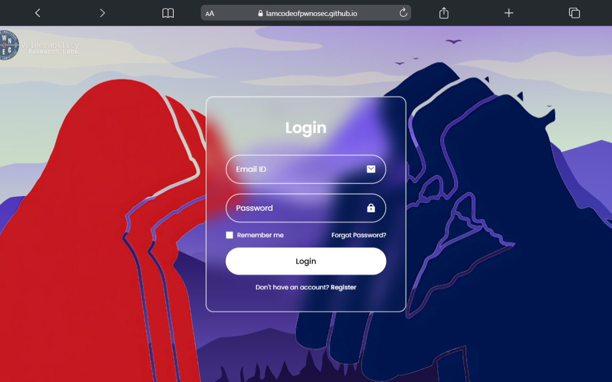

# Secure Login Page in HTML & CSS
This project features a secure login system built from the ground up using HTML and CSS. It is designed with robust security measures to protect against common web vulnerabilities, such as:
 1. **Cross-Site Scripting (XSS):** The system includes input validation and filtering mechanisms to prevent malicious script execution by blocking unsafe characters and sanitizing user input.
 1. **CSRF (Cross-Site Request Forgery) Protection:** Token-based security ensures that only legitimate requests are processed.
 1. **Content Security Policy (CSP):** A default security policy is implemented to restrict which resources can be loaded, reducing the risk of code injection.

The project prioritizes safety and simplicity, making it a useful example for learning and applying web security best practices. Explore how you can build a secure user authentication system while adhering to modern security standards.

 
